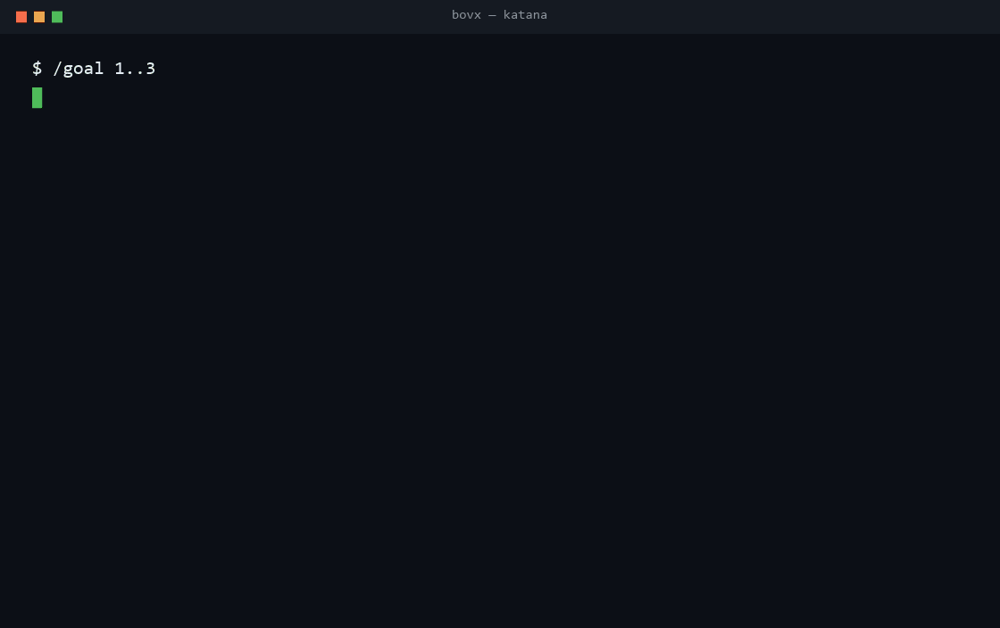
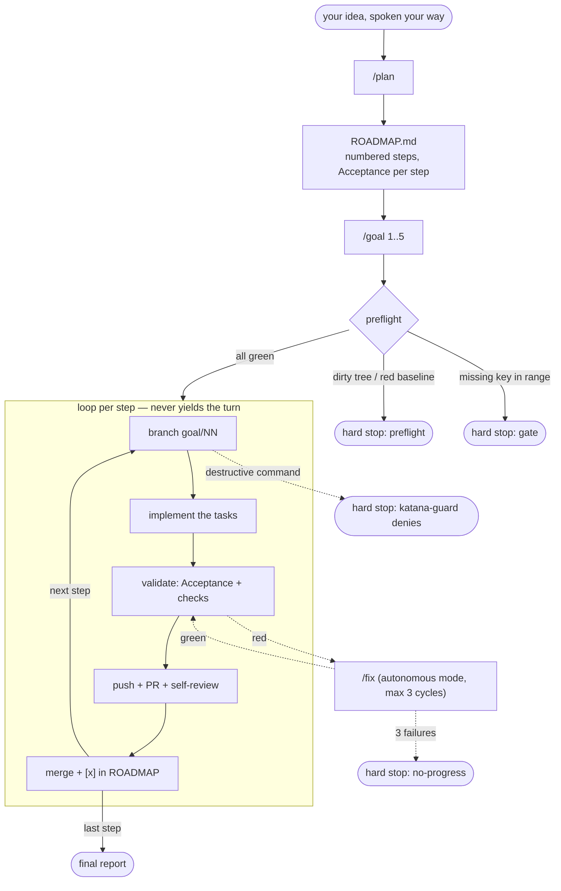

<p align="center">
  <a href="https://github.com/Marcelover777/katana">
    
  </a>
</p>

# KATANA

**An autonomous development system for Claude Code (PT-BR).** You speak the goal; Katana plans it into verifiable steps, executes with real git/GitHub — branch, PR, self-review, merge — under a mechanical leash of hooks, with state you can resume anytime and an overnight mode. The three commands (`/plan`, `/goal`, `/fix`) are just the steering wheel.

> Plan > Vibes. You set the goal. It cuts to the end — stopping only for a missing key or a dangerous move.

## What Katana is, as a whole

- **Executable planning** — a spoken idea becomes a `ROADMAP.md` of demoable vertical slices, each step with its declared gate and a command-verifiable *Acceptance*. On an existing codebase it audits first (`file:line` anchors, "Acceptance = the verifiable inverse of the finding").
- **An autonomous engine on real git** — 1 step = 1 branch = 1 adversarially self-reviewed PR = 1 merge. Implementation ambiguity never stops a run: decide, record it in the PR, keep going.
- **A mechanical leash, not a prayer** — a PreToolUse hook denies destructive commands outright (`deny`, not an instruction); a Stop hook re-injects continuation if the model tries to let go of the wheel; a SessionStart hook restores context in a single line.
- **State that survives everything** — `.katana/state.json` + the PRs are the memory; a dead session, blown context or closed laptop all resolve with `/goal resume` (GitHub/git win over the JSON).
- **Overnight** — a fail-closed headless runner drives step by step through the night and stops itself at the first bad signal.
- **Anti-bloat as code** — the lineage bloated from 5→20 commands; Katana returns to 3 and `validate.mjs` **fails CI** if a 4th appears. Three surfaces in your project, nothing else.
- **A living example** — [`examples/forecast-os/`](examples/forecast-os/) ships a real roadmap, mid-run state and the full transcript of a `/goal 1..4`.

## Katana running

<p align="center">
  
</p>

A real run: a preflight that checks everything BEFORE takeoff, self-review catching a critical leak in step 01, autonomous `/fix` killing a `ValueError` in 02, and the honest hard stop in 03 — a placeholder key doesn't burn "3 attempts", it becomes a gate with the exact resume instruction.

## The lineage

**solodev** taught the discipline: brainstorm → atomic plan → verifiable execution → honest shipping.
**Crucible** fused it into a single verb and invented the gate that stops with the exact link to the missing key.
**Forger** forged the mechanics — anti-placeholder grep, verifiable Acceptance, headless runner — but wrapped them in bureaucracy.
**Katana** is the blade: folded from all three, none of the excess. It cuts from step 1 to step 5 without stopping.

## The flow



`/fix` steps in when an Acceptance breaks: `/goal` calls it inline. When a bug shows up outside a run, you call it directly.

## The 3 commands

| Command | When | What you get |
|---|---|---|
| **/plan** | New idea (greenfield) or existing codebase (brownfield: audits with file:line anchors) | `ROADMAP.md` with demoable vertical steps + verifiable Acceptance per step, annotated `.env.example`, updated CLAUDE.md |
| **/goal** | Roadmap ready; you want the steps DONE | Steps N..M executed end to end: 1 step = 1 branch = 1 reviewed PR = 1 merge. With no argument, it's the status panel |
| **/fix** | Something broke | Disciplined diagnosis: <10s repro, falsifiable hypotheses, 1 probe per hypothesis, fix with regression test, traces cleaned |

## /goal from the inside

### Preflight — asks everything BEFORE takeoff

The only moment allowed to ask questions. After it: silence until the end.

1. `git status --porcelain` dirty → hard stop ("stashing is your call").
2. `git fetch && git checkout main && git pull --ff-only`. Diverged → hard stop. Never `reset --hard`.
3. Green baseline: runs the project's checks. Red → hard stop ("the repo was already broken before me").
4. Collects ALL gates in the N..M range and checks `.env` once (names only, never values; re-reads the disk). Missing key → stops NOW with the "❌ Missing config" block: exact var name + exact URL to get it + "put it in .env and run again". No key → no execution. No silent exception.
5. Step without a mechanical Acceptance → asks now (all questions batched) or derives one and declares it in the PR.
6. Writes `.katana/state.json`, announces the flight plan in ≤5 lines, and takes off.

### The loop

Per step K: branch `goal/KK-<slug>` → executes the tasks (read_first → action → acceptance → `[x]` → atomic commit) → validates Acceptance + checks → anti-placeholder grep on the diff (new TODO/FIXME/stub = not green) → closing pass (full suite, leftovers grep, security lens) → push + PR → adversarial self-review via subagent (critical finding: fix + re-validate, 1 cycle; the rest becomes a comment — review is advisory, what unlocks the merge is the **green mechanical Acceptance**) → merge → `[x]` in the ROADMAP, block in `.katana/LOG.md`, 1 line in the terminal:

```
[goal 3/5] step 03 merged — PR #12 (2 attempts, 14 min)
```

Implementation ambiguity NEVER stops the loop: the runner adopts its own recommendation, records the decision in the PR, and moves on. At the end, a report: table step | PR | attempts | findings | time + the "pending human eyes" list (visual checks batched at the end, never mid-run) + "next: /goal 6".

### Hard stops — a closed list. EVERYTHING else keeps going.

- **Gate**: a required key/config is missing.
- **3 failed attempts** on the same step (each including a diagnose+fix cycle).
- **Destructive-irreversible**, two layers: `katana-guard` mechanically denies (a block, not a request) force-push, `reset --hard`, `clean -f`, `rebase -i`, `filter-branch`/`+refspec`, deleting main (local or remote), committing straight to main during a run, and `rm -rf` outside the repo; and the runner refuses by its own rule (instruction, no hook) destructive migrations on real data, paid deploys, and spending money.
- **Non-trivial merge conflict** (trivial ones are auto-resolved and don't stop).
- **Product contradiction**: executing would require contradicting the written roadmap.
- **Dirty or red preflight**.
- **Caps**: step timeout (headless only) or 3 hook nudges without progress (stall).

### Authorized by definition

What Forger forbade, Katana declares the loop's happy ending: pushing the `goal/*` branch, opening a PR, commenting, merging into main **via PR**, deleting the merged branch.

### /goal resume

Session died, context overflowed, you closed the laptop? `/goal resume` re-reads `.katana/state.json` and reconciles against `gh pr list` + `git log` — **GitHub/git win over the JSON**. It resumes exactly at the pending step. `/goal stop` is the kill switch. `/goal 3..5 --dry` shows the flight plan without executing.

### Example session

The GIF at the top is a condensed run. The full, realistic transcript — preflight, a critical finding caught by self-review on step 01, one auto-fix on 02, and an honest gate stop on 03 — lives in [`examples/forecast-os/RUN-TRANSCRIPT.md`](examples/forecast-os/RUN-TRANSCRIPT.md).

## Why 3 commands

The lineage forensics measured the bloat: **5 → 16 → 20 command surfaces** and **4 → 16 → 26 artifacts** from solodev to Forger. The terminal symptom: a skill (`/dev-help`) whose only job was explaining the other 16. Four records of the same fact (PROGRESS, JOURNAL, STATUS, Status Log). Four ways to "do work". And the flagship autonomy feature, by default, advanced ONE step and stopped.

Katana goes back to **3 + 3**: three commands (/plan, /goal, /fix), three surfaces in your project (`ROADMAP.md`, `.katana/`, `.env.example`).

Admission test for any future addition: **"does it remove a stop or remove a surface?"** If not, it doesn't get in. `scripts/validate.mjs` counts the skills and fails CI if a fourth one shows up.

## Canonical vocabulary

| Term | Meaning |
|---|---|
| **step** (passo) | Unit of ROADMAP.md — a demoable vertical slice, not a micro-task |
| **task** | Internal sub-item of a step, with its own checkbox |
| **Acceptance** (Aceite) | Command-verifiable criterion (grep/test/build) — what unlocks the merge |
| **gate** | Key/config a step requires; missing = stop with the exact link |
| **hard stop** (parada dura) | An item from the closed list above; the only way /goal stops |
| **Etapa NN** | PR title for step NN |

## Installation

```powershell
# Windows
.\install.ps1            # copies skills/ into .claude/skills and hooks/ into .claude/hooks
```

```bash
# POSIX
./install.sh
```

Or as a Claude Code plugin (`.claude-plugin/plugin.json` + `marketplace.json`). Then, **once per repo**:

```
/goal setup
```

That writes the git/gh permission allowlist to `.claude/settings.json` (otherwise every command prompts and kills the "non-stop"), registers the hooks, and gitignores `.katana/tmp/` and `state.json`.

### Safety

- **`hooks/katana-guard.js`** (PreToolUse) mechanically denies the destructive list via `permissionDecision: "deny"` — a hard block, not a polite request. Active during runs; force-push, `reset --hard` and `clean -f` are denied whenever it's installed.
- **`hooks/katana-continue.js`** (Stop) re-injects continuation if the model tries to yield the turn with steps pending; 3 nudges without progress → lets it stop and marks a stall.
- **`hooks/katana-session-start.js`** injects 1 line of state (~55 tokens) into a fresh session.
- Philosophy: **copying is harmless, activating is explicit opt-in (`/goal setup`).** Never ask for `bypassPermissions` — the allowlist + guard give the same flow with a leash on.
- The runner never echoes a secret value (names only), never uses `git add -f`, and the self-review checks the diff for secrets as a fixed item.

## FAQ

**What if the session dies mid-run?**
`/goal resume`. State lives in `.katana/state.json` and in the PRs — the session is disposable. The SessionStart hook still injects 1 line of context into the new session.

**Can I use it on an existing project?**
Yes. `/plan` detects code and switches to brownfield mode: it audits with file:line anchors and seeds steps with "Acceptance = the verifiable inverse of the finding". ⏭️ not-evaluated never becomes a presumed ✅.

**Does it work without a GitHub remote?**
It does. Preflight asks once whether to create the repo; if not, each step closes with a local `--no-ff` merge instead of a PR.

**How do I run it overnight?**
`scripts/goal.ps1` (headless): one `claude -p "/goal step K" --resume <sid>` invocation PER step, branching on the JSON `subtype` (never on exit code), fail-closed — no status written means the runner stops instead of running blind.

**Why is there no /status?**
`/goal` with no argument IS the panel — derived from real files (ROADMAP checkboxes, state.json, git), never from guesswork, and it ends by pointing at the next step. One more command would be one more surface, and the rule is to remove surfaces.

---

**Start now:** `/plan` with your idea, your way → `ROADMAP.md` → `/goal 1..N`. When it breaks: `/fix`.

MIT · lineage solodev → Crucible → Forger → **Katana**
