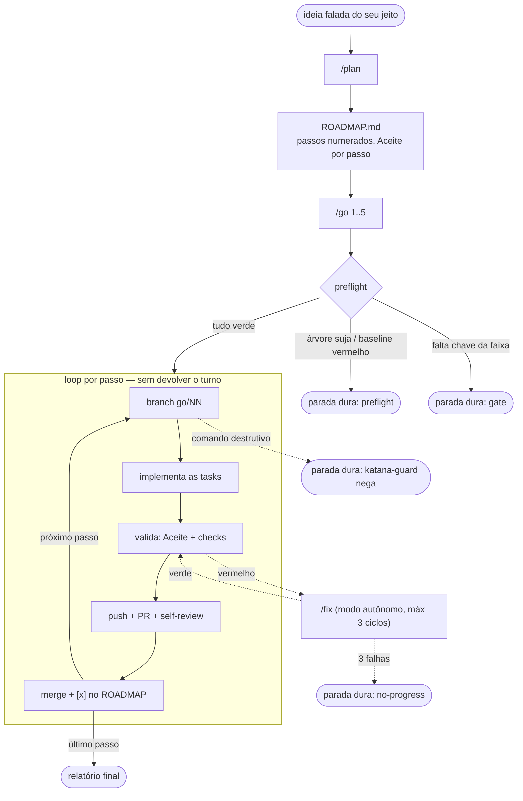

# KATANA

**Plan > Vibes. Três comandos: /plan desenha o mapa, /go dirige até o fim, /fix quando quebra.**

> /plan desenha o mapa. /go dirige até o fim — só para se faltar chave ou for perigoso. /fix quando quebra.

Essa frase é o manual inteiro. O resto deste README é detalhe.

## A linhagem

O **solodev** ensinou a disciplina: brainstorm → plano atômico → execução verificável → ship honesto.
O **Crucible** fundiu tudo num verbo só e inventou o gate que para com o link exato da chave faltando.
O **Forger** forjou as mecânicas — anti-placeholder por grep, Aceite verificável, runner headless — mas as embrulhou em burocracia.
A **Katana** é a lâmina: dobrada dos três, sem o excesso. Corta do passo 1 ao 5 sem parar.

## O fluxo



`/fix` entra quando um Aceite quebra: o `/go` o chama inline. Quando um bug aparece fora de um run, você o chama direto.

## Os 3 comandos

| Comando | Quando | O que entrega |
|---|---|---|
| **/plan** | Ideia nova (greenfield) ou codebase existente (brownfield: audita com âncora arquivo:linha) | `ROADMAP.md` com passos verticais demoáveis + Aceite verificável por passo, `.env.example` anotado, CLAUDE.md atualizado |
| **/go** | Roadmap pronto; você quer os passos FEITOS | Passos N..M executados de ponta a ponta: 1 passo = 1 branch = 1 PR revisado = 1 merge. Sem argumento, é o painel de status |
| **/fix** | Algo quebrou | Diagnóstico disciplinado: reprodução <10s, hipóteses falsificáveis, 1 probe por hipótese, fix com teste de regressão, rastros limpos |

## /go por dentro

### Preflight — pergunta tudo ANTES de decolar

O único momento que pode perguntar. Depois dele, silêncio até o fim.

1. `git status --porcelain` sujo → parada dura ("stash é decisão sua").
2. `git fetch && git checkout main && git pull --ff-only`. Divergiu → parada dura. Nunca `reset --hard`.
3. Baseline verde: roda os checks do projeto. Vermelho → parada dura ("o repo já estava quebrado antes de mim").
4. Coleta TODOS os gates da faixa N..M e confere o `.env` de uma vez (só nomes, nunca valores; relê o disco). Faltou chave → para AGORA com o bloco "❌ Falta configurar": var exata + URL exata de onde pegar + "põe no .env e roda de novo". Sem chave → sem execução. Sem exceção silenciosa.
5. Passo sem Aceite mecânico → pergunta agora (todas juntas) ou deriva um e declara no PR.
6. Escreve `.katana/state.json`, anuncia o plano de voo em ≤5 linhas e decola.

### O loop

Por passo K: branch `go/KK-<slug>` → executa as tasks (read_first → action → acceptance → `[x]` → commit atômico) → valida Aceite + checks → grep anti-placeholder no diff (TODO/FIXME/stub novo = não está verde) → fechamento (suite completa, grep de restos, lente de segurança) → push + PR → self-review adversarial via subagente (achado crítico: fix + re-valida, 1 ciclo; o resto vira comentário — review é advisory, quem destrava o merge é o **Aceite mecânico verde**) → merge → `[x]` no ROADMAP, bloco no `.katana/LOG.md`, 1 linha no terminal:

```
[go 3/5] etapa 03 mergeada — PR #12 (2 tentativas, 14 min)
```

Ambiguidade de implementação NUNCA para o loop: o runner adota a própria recomendação, registra a decisão no PR e segue. No fim, relatório: tabela etapa | PR | tentativas | achados | tempo + a lista "pendente de olho humano" (verificações visuais agregadas em batch, nunca no meio do run) + "próximo: /go 6".

### Paradas duras — lista fechada. TUDO o resto segue.

- **Gate**: chave/config exigida e ausente.
- **3 tentativas falhas** no mesmo passo (cada uma com ciclo de diagnóstico+fix).
- **Destrutivo-irreversível**, em duas camadas: o `katana-guard` nega mecanicamente (não é pedido, é bloqueio) force-push, `reset --hard`, `clean -f`, `rebase -i`, `filter-branch`/`+refspec`, deletar main (local ou remota), commit direto em main durante run e `rm -rf` fora do repo; e o runner recusa por regra própria (instrução, sem hook) migration destrutiva com dados, deploy pago e gastar dinheiro.
- **Conflito de merge não-trivial** (trivial é auto-resolvido e não para).
- **Contradição de produto**: executar exigiria contradizer o roadmap escrito.
- **Preflight sujo ou vermelho**.
- **Caps**: timeout de etapa (só headless) ou 3 nudges do hook sem progresso (stall).

### Autorizado por definição

O que o Forger proibia, a Katana declara fim feliz do loop: push da branch `go/*`, criar PR, comentar, mergear na main **via PR**, deletar branch mergeada.

### /go resume

Sessão morreu, contexto estourou, você fechou o notebook? `/go resume` relê `.katana/state.json` e reconcilia com `gh pr list` + `git log` — **GitHub/git ganham do JSON**. Retoma exatamente do passo pendente. `/go stop` é o kill switch. `/go 3..5 --dry` mostra o plano de voo sem executar.

### Sessão de exemplo (condensada)

```
> /go 1..3
Preflight: árvore limpa ✅ · main atualizado ✅ · baseline verde ✅
Gates da faixa: DATABASE_URL ✅, API_TOKEN ✅ — decolando.
[go 1/3] etapa 01 mergeada — PR #1 (1 tentativa, 8 min)
[go 2/3] etapa 02 mergeada — PR #2 (2 tentativas: 1 auto-fix de teste, 11 min)
[go 3/3] etapa 03 mergeada — PR #3 (self-review pegou off-by-one, corrigido, 15 min)

RELATÓRIO — 3/3 mergeados · pendente de olho humano: conferir o gráfico da home
próximo: /go 4
```

A transcrição completa e realista de um run — preflight, um crítico pego pelo self-review na etapa 01, um auto-fix na 02 e uma parada de gate honesta na 03 — está em [`examples/forecast-os/RUN-TRANSCRIPT.md`](examples/forecast-os/RUN-TRANSCRIPT.md).

## Por que 3 comandos

A forense da linhagem mediu o inchaço: **5 → 16 → 20 superfícies de comando** e **4 → 16 → 26 artefatos** do solodev ao Forger. O sintoma terminal: uma skill (`/dev-help`) cujo único trabalho era explicar as outras 16. Quatro registros do mesmo fato (PROGRESS, JOURNAL, STATUS, Status Log). Quatro formas de "executar trabalho". E o carro-chefe da autonomia, por default, avançava UM passo e parava.

A Katana volta para **3 + 3**: três comandos (/plan, /go, /fix), três superfícies no seu projeto (`ROADMAP.md`, `.katana/`, `.env.example`).

Teste de admissão para qualquer adição futura: **"isso remove uma parada ou remove uma superfície?"** Senão, não entra. O `scripts/validate.mjs` conta as skills e falha o CI se aparecer uma quarta.

## Vocabulário canônico

| Termo | Significado |
|---|---|
| **passo** | Unidade do ROADMAP.md — fatia vertical demoável, não micro-tarefa |
| **task** | Subitem interno de um passo, com checkbox próprio |
| **Aceite** | Critério verificável por comando (grep/test/build) — o que destrava o merge |
| **gate** | Chave/config exigida por um passo; ausente = parada com o link exato |
| **parada dura** | Um item da lista fechada acima; a única forma de o /go parar |
| **Etapa NN** | Título do PR do passo NN |

## Instalação

```powershell
# Windows
.\install.ps1            # copia skills/ para .claude/skills e hooks/ para .claude/hooks
```

```bash
# POSIX
./install.sh
```

Ou como plugin do Claude Code (`.claude-plugin/plugin.json` + `marketplace.json`). Depois, **uma vez por repo**:

```
/go setup
```

Isso escreve a allowlist de permissões git/gh no `.claude/settings.json` (senão cada comando pede prompt e mata o "sem parar"), registra os hooks e adiciona `.katana/tmp/` e `state.json` ao gitignore.

### Segurança

- **`hooks/katana-guard.js`** (PreToolUse) nega mecanicamente a lista destrutiva via `permissionDecision: "deny"` — força bruta, não pedido educado. Ativo durante runs; force-push, `reset --hard` e `clean -f` são negados sempre que instalado.
- **`hooks/katana-continue.js`** (Stop) re-injeta a continuação se o modelo tentar devolver o turno com etapas pendentes; 3 nudges sem progresso → deixa parar e marca stall.
- **`hooks/katana-session-start.js`** injeta 1 linha de estado (~55 tokens) na sessão nova.
- Filosofia: **copiar é inofensivo, ativar é opt-in explícito (`/go setup`).** Nunca peça `bypassPermissions` — a allowlist + guard dão o mesmo fluxo com coleira.
- O runner nunca ecoa valor de segredo (só nomes), nunca usa `git add -f`, e o self-review checa segredos no diff como item fixo.

## FAQ

**E se a sessão morrer no meio de um run?**
`/go resume`. O estado vive em `.katana/state.json` e nos PRs — a sessão é descartável. O hook de SessionStart ainda injeta 1 linha de contexto na sessão nova.

**Posso usar num projeto existente?**
Sim. `/plan` detecta código e entra em modo brownfield: audita com âncora arquivo:linha e semeia passos com "Aceite = inverso verificável do achado". ⏭️ não-avaliado nunca vira ✅ presumido.

**Funciona sem GitHub remote?**
Funciona. O preflight pergunta 1x se quer criar o repo; se não, cada passo fecha com merge local `--no-ff` em vez de PR.

**Como rodo à noite?**
`scripts/go.ps1` (headless): uma invocação `claude -p "/go step K" --resume <sid>` POR etapa, ramificando no `subtype` do JSON (nunca em exit code), fail-closed — sem status escrito, o runner para em vez de rodar às cegas.

**Por que não tem /status?**
`/go` sem argumento É o painel — derivado de arquivos reais (checkboxes do ROADMAP, state.json, git), nunca de palpite, e termina apontando o próximo passo. Um comando a mais seria uma superfície a mais, e a regra é remover superfícies.

---

**Comece agora:** `/plan` com a ideia do seu jeito → `ROADMAP.md` → `/go 1..N`. Quando quebrar: `/fix`.

MIT · linhagem solodev → Crucible → Forger → **Katana**
